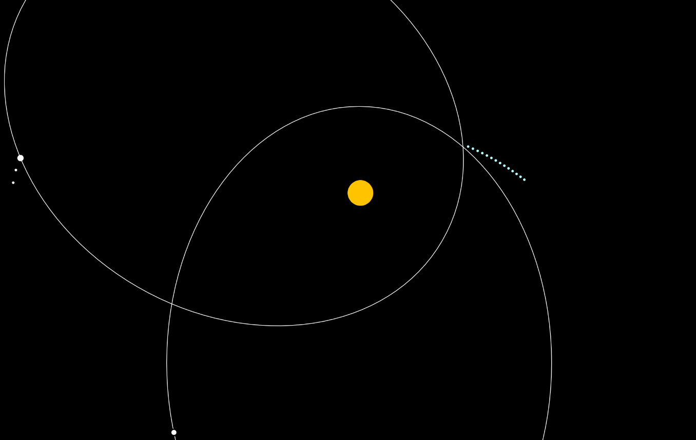

# Kepler-Law-Simulation-JS
### This is basic simulation of three Kepler laws. Repository is mainly built with P5.js .
To reproduce gif, use live server to your likings. (Works flawlessly with [visual studio code live server extension](https://marketplace.visualstudio.com/items?itemName=ritwickdey.LiveServer) )

[Here's article if you don't know what these laws are about.](https://en.wikipedia.org/wiki/Kepler%27s_laws_of_planetary_motion)

All three laws are implemented.
